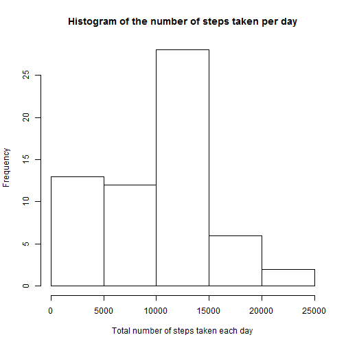
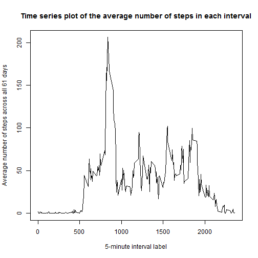
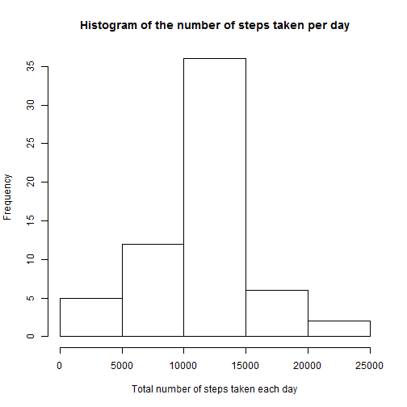

# Reproducible Research: Peer Assessment 1


## Loading and preprocessing the data

We assume that the file `activity.csv` containing the data for this assignment
is contained in the current working directory. We begin by loading the data:

```r
activityData <- read.csv("./activity.csv")
```

The only preprocessing step we need (for the last part of the assignment)
is to convert the date column into actual Dates:

```r
activityData$date <- as.Date(activityData$date, format = "%Y-%m-%d")
```


## What is mean total number of steps taken per day?

First we compute the total number of steps taken each day. For the purposes
of this part of the analysis, we ignore the missing values.

```r
dayTotals <- tapply(activityData$steps, as.factor(activityData$date), function(x) sum(x, 
    na.rm = TRUE))
```

We generate a histogram of the total number of steps taken each day:

```r
hist(dayTotals, xlab = "Total number of steps taken each day", main = "Histogram of the number of steps taken per day")
```

 

We also calculate the mean and median total number of steps taken per day:

```r
mean(dayTotals)
```

```
## [1] 9354
```

```r
median(dayTotals)
```

```
## [1] 10395
```


## What is the average daily activity pattern?
First we calculate the average number of steps taken in each
5-minute interval, across all the days. As before, we ignore
the missing values in this part of the analysis.

```r
intervalAverages <- tapply(activityData$steps, as.factor(activityData$interval), 
    function(x) mean(x, na.rm = TRUE))
```

Now we make a time series plot of these averages:

```r
plot(levels(as.factor(activityData$interval)), intervalAverages, type = "l", 
    main = "Time series plot of the average number of steps in each interval", 
    xlab = "5-minute interval label", ylab = "Average number of steps across all 61 days")
```

 

Next we determine the 5-minute interval with the maximum average number
of steps and report the label of that interval.

```r
i <- which.max(intervalAverages)
activityData$interval[i]
```

```
## [1] 835
```


## Imputing missing values
We begin by calculating the logical vector indicating which values in the
dataset are missing, and then computing the total number of missing entries:

```r
missing <- is.na(activityData$steps)
sum(missing)
```

```
## [1] 2304
```

As suggested in the assignment description, we first create a new data set
by copying the old one, and then replace each missing entry in the new set
with the average of all available entries for that 5-minute time interval.

```r
activityDataNew <- activityData
activityDataNew$steps[missing] <- intervalAverages[as.character(activityData$interval[missing])]
```

After the missing values have been imputed, we repeat two earlier steps:
we compute the total number of steps taken each day, generate a histogram
of these numbers and also report the mean and median of these numbers:

```r
dayTotalsNew <- tapply(activityDataNew$steps, as.factor(activityDataNew$date), 
    sum)
hist(dayTotalsNew, xlab = "Total number of steps taken each day", main = "Histogram of the number of steps taken per day")
```

 

```r
mean(dayTotalsNew)
```

```
## [1] 10766
```

```r
median(dayTotalsNew)
```

```
## [1] 10766
```

As we can see by comparing this histogram and the mean and median values
with the ones obtained earlier, filling in the missing data has had a
significant impact on the estimates of the total number of daily steps.


## Are there differences in activity patterns between weekdays and weekends?
We add a factor variable (called dayType) to the new data set, with two
levels, "weekday" and "weekend", indicating whether the corresponding
date is a weekday or a weekend.

```r
wkdays <- c("Monday", "Tuesday", "Wednesday", "Thursday", "Friday")
wkends <- c("Saturday", "Sunday")
iswkday <- function(day) !(weekdays(day) %in% wkends)
activityDataNew$dayType <- as.factor(ifelse(iswkday(activityDataNew$date), "weekday", 
    "weekend"))
```

Now we split the new data set into two parts, corresponding to weekdays
and to weekends:

```r
splitActivity <- split(activityDataNew, activityDataNew$dayType)
```

The result is a list consisting of two data frames. To each of these two
data frames, we apply a function that calculates the average number of steps
in each 5-minute time interval:

```r
avgFun <- function(data) {
    tapply(data$steps, as.factor(data$interval), mean)
}
splitIntAvgs <- sapply(splitActivity, avgFun)
```

For the next step, we need to convert `splitIntAvgs` into a data frame
that has the format which makes it easy to apply the `xyplot` function
from the `lattice` package:

```r
splitIntAvgs <- data.frame(steps = c(splitIntAvgs[, "weekend"], splitIntAvgs[, 
    "weekday"]), interval = as.integer(rep(rownames(splitIntAvgs), 2)), dayType = rep(c("weekend", 
    "weekday"), each = nrow(splitIntAvgs)))
```

Now we make two time series plots of the number of steps taken in each
5-minute time interval, averaged over all weekdays and all weekends,
respectively:

```r
library(lattice)
xyplot(steps ~ interval | dayType, data = splitIntAvgs, layout = c(1, 2), type = "l", 
    xlab = "Interval", ylab = "Number of steps")
```

 

